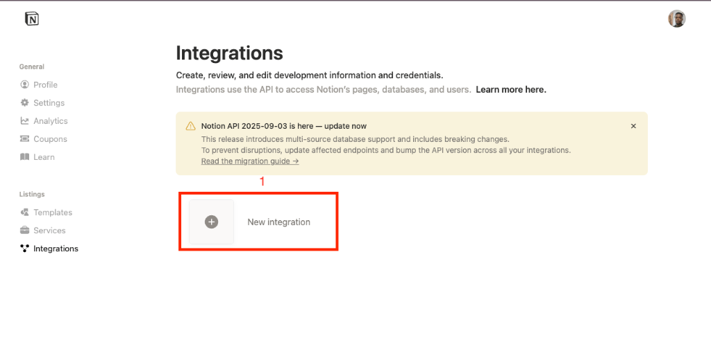
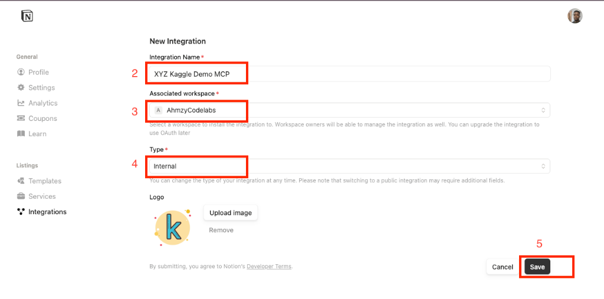
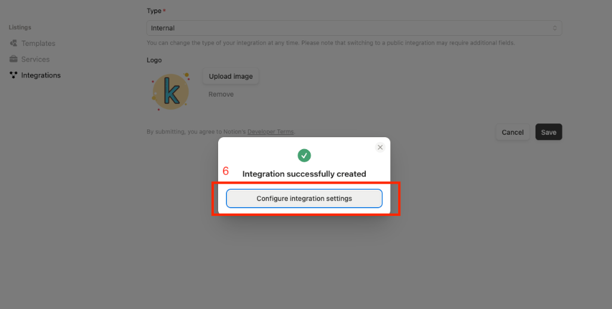
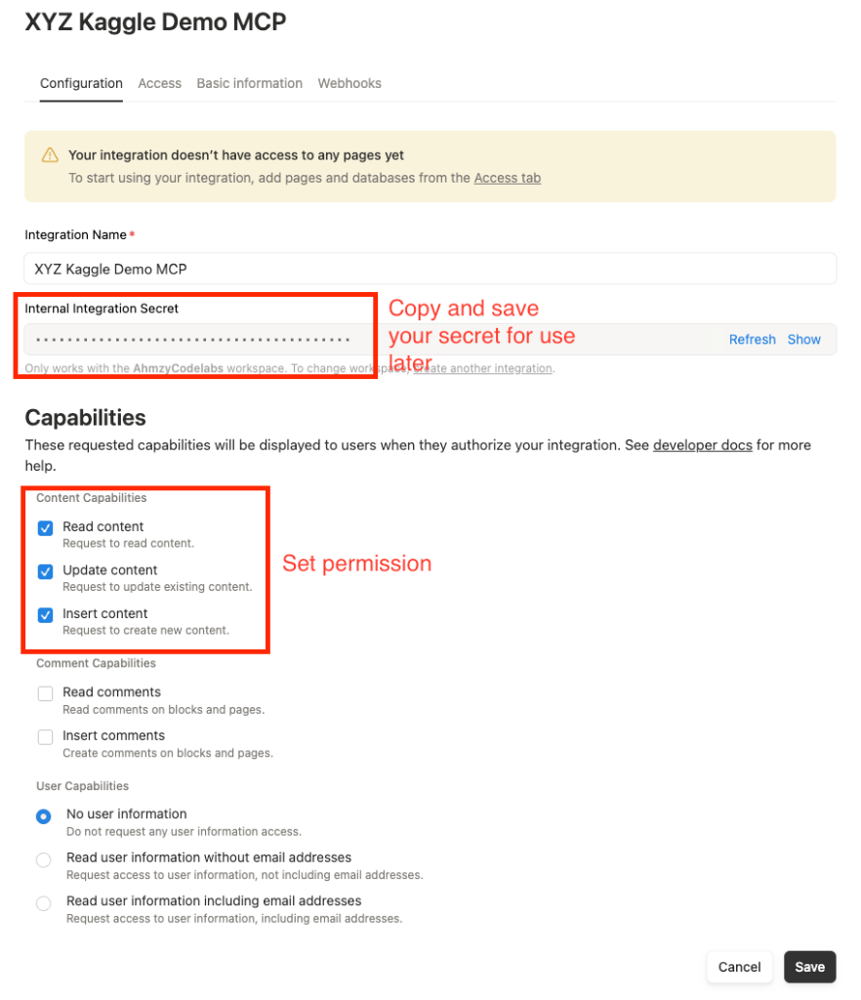
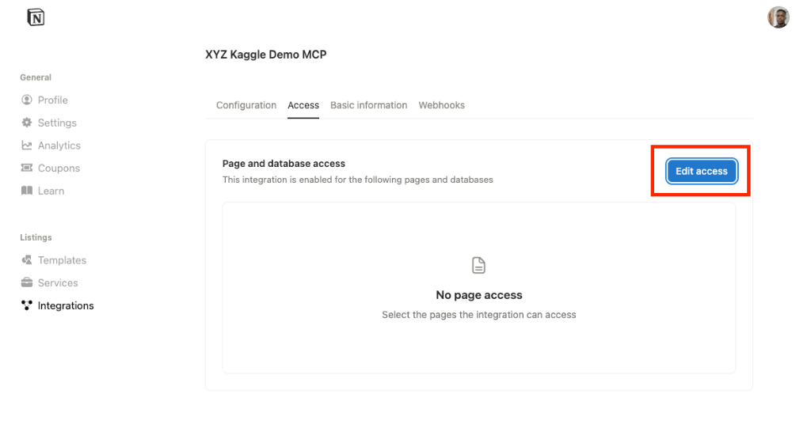
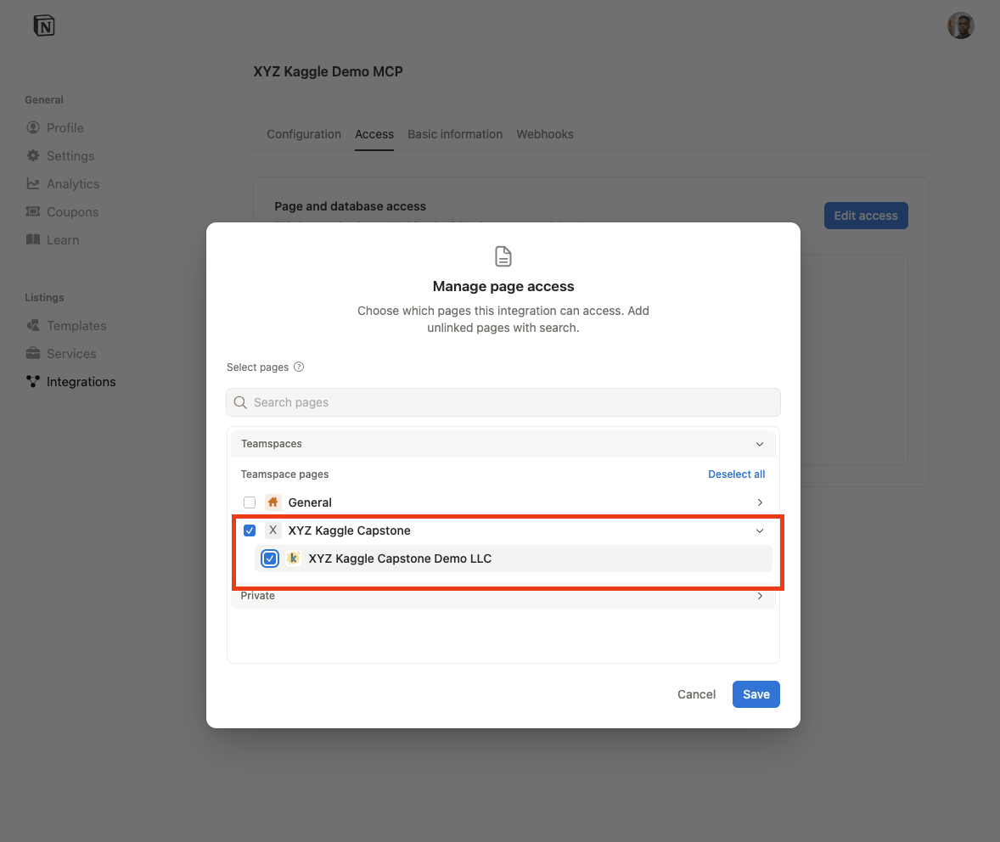
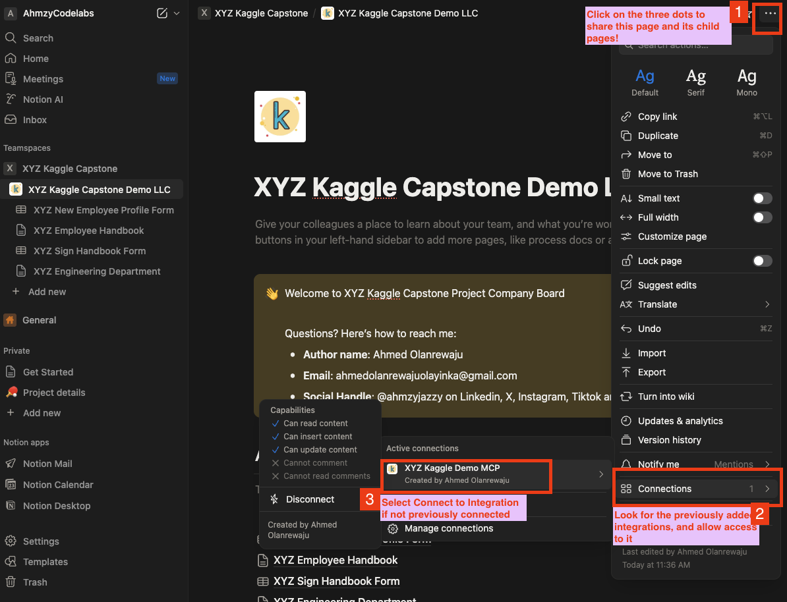

# Setting Up Notion MCP for HireFlow

This guide explains how to configure the Notion Model Context Protocol (MCP) server to enable the HireFlow agent to access your Notion workspace. This allows the agent to read documentation (like employee handbooks) and access forms directly from your Notion workspace.

## Prerequisites

- A Notion account and workspace. 
> The FREE tier account is sufficient for this demo
- Admin access to the workspace to create integrations.

## Step-by-Step Setup

### 1. Create a New Integration

1.  Go to [https://www.notion.so/profile/integrations](https://www.notion.so/profile/integrations ).
2.  Click the **"New integration"** button.



### 2. Configure Integration Details

1.  **Name**: Enter a descriptive name, e.g., `XYZ Kaggle Demo MCP`.
2.  **Associated workspace**: Select the workspace you want the agent to access (e.g., `AhmzyCodelabs`).
3.  **Type**: Select **Internal**.tion
4.  Review your settings.
5.  Click **Save**.



### 3. Integrations setting
After saving, you'll see a success message. Click **Configure integration settings**.



### 4. Configure Capabilities

1.  Ensure the following **Capabilities** are checked under the "Capabilities" tab:
    - **Read content**
    - **No user information** (unless you specifically need it)

> if you want to allow Update and Insert content permission can enable as seen.

2.  You can copy the generated **Internal Integration Secret** as your `NOTION_API_KEY`




### 5. Edit Access

1.  Click the **Access** tab to proceed to edit which page or resources the MCP will have access to
2.  Click **Show** and then **Copy** this key.
3.  **Save this key securely.** You will need it for the next step.



3.  **Specify Page.** Specify the previously created Notion team workspace and pages.



### 6. Configure HireFlow

1.  Open the `.env` file in your `hireflow` project root.
2.  Add your copied secret as the `NOTION_API_KEY`:

```bash
NOTION_API_KEY=secret_your_copied_secret_key_here
```

### 7. Share Pages with the Integration

**Crucial Step:** The integration cannot see any pages by default. You must explicitly share pages with it.

1.  Open the Notion page or database you want the agent to access (e.g., "Employee Handbook", "Onboarding Checklist").
2.  Click the **...** (three dots) menu at the top right of the page.
3.  Scroll down to **Connections**.
4.  Search for and select your integration (`XYZ Kaggle Demo MCP`).
5.  Confirm the connection.

> Repeat this for any other pages or databases the agent needs to access.



## Verification

To verify the setup:
1.  Run the agent playground: `make playground`.
2.  Ask the agent to "Read the employee handbook" (ensure you've shared a page with that title).
3.  The agent should be able to retrieve the content.

## Sampe Resources Created

The following resources are public and accessible. You can use them to create yours.

* Employee profile form link @[XYZ Staff Profile](https://www.notion.so/ahmzycodelabs/2b417e3ac68d80b7bffac10a1fb2b8dd?source=copy_link)

* Employee handbook link @[XYZ Employee Handbook](https://www.notion.so/ahmzycodelabs/XYZ-Employee-Handbook-2b417e3ac68d802e90e2de55b6be989f?source=copy_link)

* Employee Sign Handbook @[Link @XYZ Sign Handbook](https://www.notion.so/ahmzycodelabs/2b417e3ac68d81a8b23cca9cb6deca69?source=copy_link)

* Engineering Department Link @[XYZ Engineering Department](https://www.notion.so/ahmzycodelabs/XYZ-Engineering-Department-2b417e3ac68d80e78a48d6d62fe75d37?source=copy_link)

* Employee Handbook: [XYZ Employee Handbook](https://www.notion.so/ahmzycodelabs/2b417e3ac68d80b7bffac10a1fb2b8dd?source=copy_link)

* Onboarding checklist: [XYZ Onboarding Checklist](https://www.notion.so/ahmzycodelabs/2b417e3ac68d80b7bffac10a1fb2b8dd?source=copy_link)
